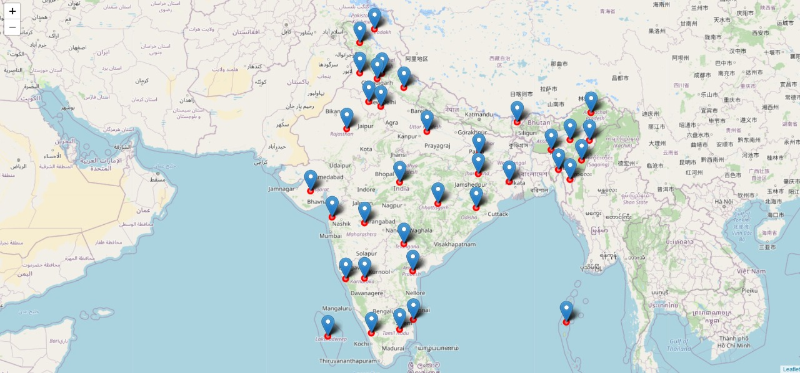
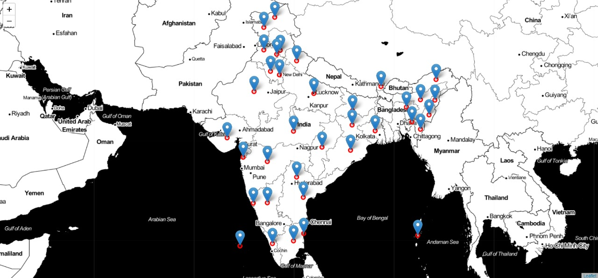
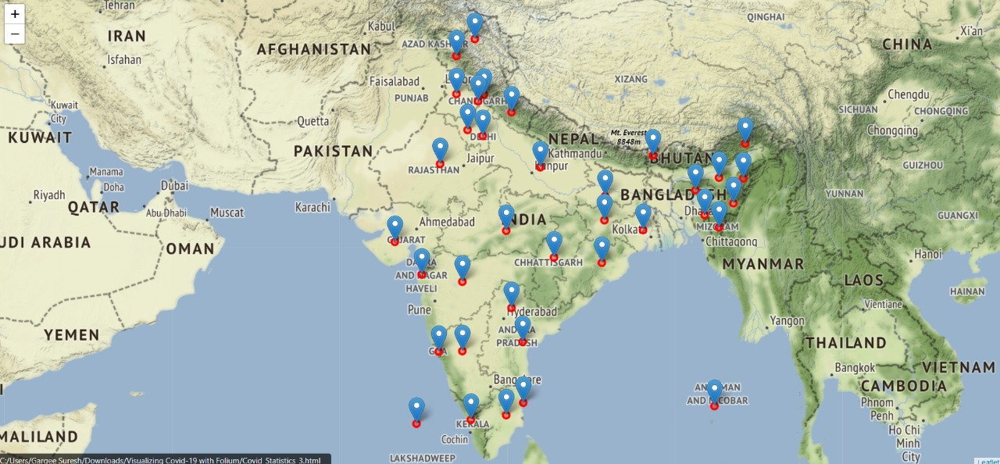
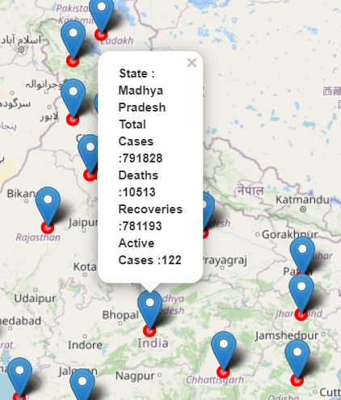

# Visualizing-Covid-19-with-Folium 
Using Folium, I visualize real-time Covid-19(Indian) stats scraped from [mygov.in](https://www.mygov.in/corona-data/covid19-statewise-status/) and display it on an interactive map.
  ### Classic
  

  
  

  
  ### Stamen Toner
  

  
  

  
  ### Stamen Terrain
  

  
  

  
  ### Snapshot of real-time data on the map
  

## Resources 
* [Introduction to Folium](http://python-visualization.github.io/folium/)
* [mygov.in](https://www.mygov.in/corona-data/covid19-statewise-status/) for scraping covid-19 statewise data in India
* [Data Visualization using python](https://towardsdatascience.com/impact-of-covid-19-data-visualization-using-python-6f8e3bdc860b)

